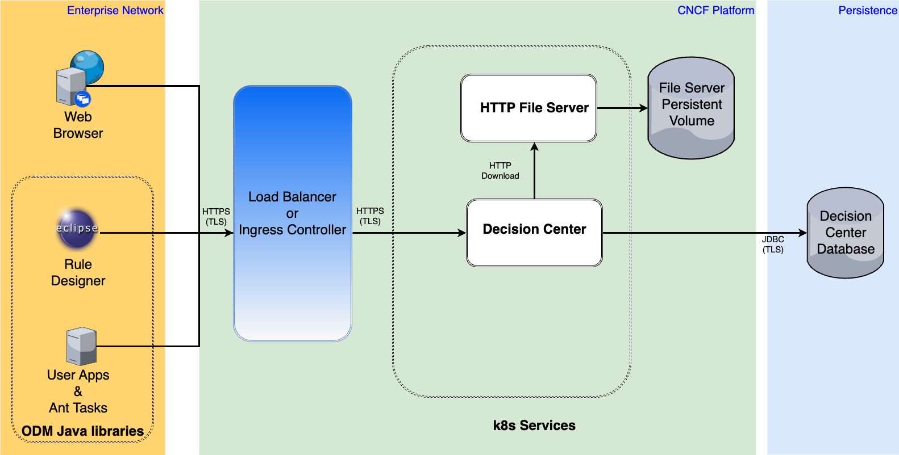

# Decision Center Samples

The aim of these tutorials is to explain on how to manage the [Decision Center samples](https://www.ibm.com/docs/en/odm/9.0.0?topic=center-samples) in a kubernetes environment which is quite different of the ODM on Premise context.
For several samples, some ODM materials (jar, javascript, html, css, configuration files, ...) need to be downloaded on Decision Center :
* We will explain how to build the java sample files without the installation of ODM on Premise.    
* We will explain how to set up an Httpd file server to download the materials on Decision Center.

We prefer to provide a solution using a file server instead of the former deprecated solution using a PVC because :
* no need to manage copy on the PV with a cluster access
* no need to manage Decision Center pod restart
* no Decision Center scaling issue according to the PersistentVolume available [access mode](https://kubernetes.io/docs/concepts/storage/persistent-volumes/#access-modes) and [type](https://kubernetes.io/docs/concepts/storage/persistent-volumes/#types-of-persistent-volumes)   

Obviously the following solution is a proposition and can be modified according to the Business Use-Case.



The sample use-cases will be managed in 3 steps.
* 1- build the java samples using the ODM java libraries 
* 2- setup an Httpd file server to upload all the sample material
* 3- launch the ODM Helm instance by downloading the sample material from the Httpd file server 

## Build the java samples

To build the java samples, you need the [ODM jar libraries stored in the decision-center-client-api.zip file](https://www.ibm.com/docs/en/odm/9.0.0?topic=reference-decision-center-assets#concept_tyl_mkx_qpb__dc__title__1).
A first dummy helm install is needed to provide an access to the Decision Center asset.
You can follow the steps according to your [platform](https://github.com/DecisionsDev/odm-docker-kubernetes/tree/master/platform) 
You can follow [these steps](https://github.com/DecisionsDev/odm-docker-kubernetes/tree/master/platform/roks#2-prepare-your-environment-for-the-odm-installation-5-min) if you are on OpenShift.  

Now, you can unzip the decision-center-client-api.zip file.
You will have to import in your java project all jar located in the **teamserver/lib** and **teamserver/lib/eclipse_plugins** directory.

## Setup an Httpd file server

With ODM on premise, the Decision Center war file need to be rebuild.
With ODM on k8s,  we will download in Decision Center the needed jar files using the **decisionCenter.downloadUrl** helm chart parameter.
The downloaded material will be available in the Decision Center pod inside the /config/download directory which is by default in the classloader. So, it's automatically taken into account by Decision Center
If you provide a compressed zip or tar file, it's automatically unzipped.

If you don't have in your kubernetes environment a ready to use solution like an FTP server, we propose to upload the Decision Center material in an Httpd server using the [Bitnami HTTP Server Helm Chart](https://artifacthub.io/packages/helm/bitnami/apache)

```bash
helm repo add bitnami https://charts.bitnami.com/bitnami
helm repo update 
```

Create a configmap to provide the httpd.conf configuration file that activate the Dav module.
It's the default **httpd.conf** file withe the following modifications :

-1- Activation of the Dav module with :

LoadModule dav_module modules/mod_dav.so 
LoadModule dav_fs_module modules/mod_dav_fs.so

-2- Creation of a Dav lock DB directory :

DavLockDB /tmp/lock

-3- Enabling Dav in the default root directory :

DocumentRoot "/opt/bitnami/apache/htdocs"
<Directory "/opt/bitnami/apache/htdocs"> 
Dav On
...
</Directory>
  

```bash
kubectl create configmap httpd-cm --from-file=httpd.conf
```

Create a PVC to persist all the downloads, by adapting the storage.
Pay attention to manage download file size adapted to the Decision Center ephemeral storage to avoid pod eviction if the download can not be managed. 

```bash
kubectl create -f httpd-pvc.yaml
```

Instanciate the Apache Http file server

```bash
helm install fileserver bitnami/apache -f httpd-values.yaml
```

[Optional] Expose the service
The service exposition is optional. It's only needed if you want to manage an upload on the file server instead of a kubernetes file copy.

```bash
kubectl expose svc fileserver-apache
```

If you are on OCP, you can get the fileserver route URL to upload the sample jar or zip file.

```bash
curl -T <decisioncenter-sample-file> http://<fileserver-url>
<!DOCTYPE HTML PUBLIC "-//W3C//DTD HTML 4.01//EN" "http://www.w3.org/TR/html4/strict.dtd">
<html>
<head>
<title>201 Created</title>
</head><body>
<h1>Created</h1>
<p>Resource /<decisioncenter-sample-file> has been created.</p>
</body></html>
```

If, for security reason, it's not allowed to expose the service, you can directly copy the <decisioncenter-sample-file> on the file server pod after a cluster login :

```bash
kubectl cp <decisioncenter-sample-file> <namespace>/<file-server-pod-name>:/opt/bitnami/apache/htdocs/<decisioncenter-sample-file> -n <namespace>
```
