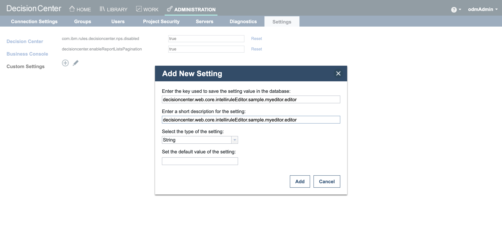
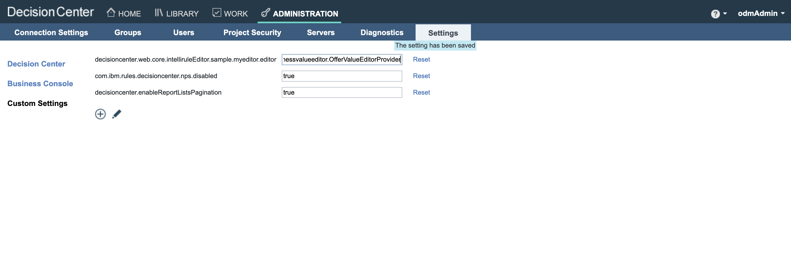
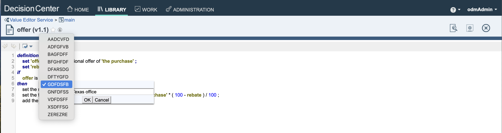

### Introduction

This readme explains how to run the Custom Value Editor sample in Docker.

Doing so, you do not need to have ODM installed. Instead we are relying on the 'ODM for developer' container image.

Before following the steps below, make sure you have built the images as explained in [README.md](README.md).

### Running the sample 

   Run ODM docker images
   ```bash
   docker-compose -f compose-odm-dev.yml up odm-with-custom-value-editor
   ```

###  Using the Sample

Access Decision Center using the URL **http://localhost:9060** <!-- markdown-link-check-disable-line -->

Click on the link **Decision Center Business Console**

Log in with odmAdmin/odmAdmin

To activate the Custom Value Editor, after login in Decision Center as an administrator :
- Go in the menu **Administration>Settings>Custom Settings**
- Register a new setting named **decisioncenter.web.core.intelliruleEditor.sample.myeditor.editor** keeping blank the **default value of the setting** field.



- Set the value of **decisioncenter.web.core.intelliruleEditor.sample.myeditor.editor** to **businessvalueeditor.OfferValueEditorProvider**



Load the [ValueEditorService.zip](./projects/ValueEditorService.zip) Decision Service.

Follow [Running this sample](https://www.ibm.com/docs/en/odm/9.0.0?topic=editor-custom-value-sample-details#businessconsolecustomvalueeditorsampledetails__rssamples.uss_rs_smp_tsauthoring.1025134__title__1) details to understand how to use the custom value editor.

Below is the Custom Value Editor display inside the Business Console :



### Stopping the Sample

```bash
docker-compose -f compose-odm-dev.yml down
```


