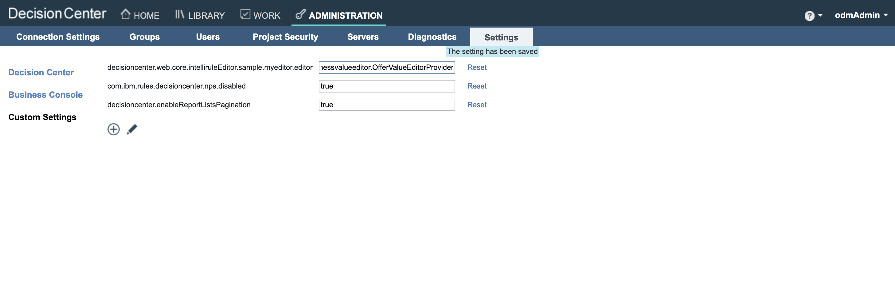

# Introduction

This README explains how to run the Custom Value Editor sample in Kubernetes.
Before following the steps below, make sure you have built the images as explained in [README.md](README.md).

#  Configuring the sample in Kubernetes

## 1. Uploading ZIP file on a file server

The customization ZIP file can be made available to Decision Center in two ways:
1. the **legacy way**: by copying the JARs to a PVC and referencing this PVC using the parameter `decisionCenter.customlibPvc`
1. or the **new way** (since 9.0 only): by copying the JARs on a file server and referencing the files to download from this file server using the parameter `decisionCenter.downloadUrl`

This document explains how to follow the **new way**. Any file server reachable by Decision Center is suitable. You can either use an existing one or follow the instructions [here](https://github.com/DecisionsDev/odm-docker-kubernetes/blob/vnext-release/contrib/file-server/README.md#setup-an-httpd-file-server) to deploy a httpd file server in a new pod.

However you must use the **legacy way** if you deploy a version of ODM older than 9.0. Here are some [instructions](https://www.ibm.com/docs/en/odm/9.0.0?topic=kubernetes-customizing-decision-center-business-console) in the documentation.

Upload the businessvalueeditor-1.0.zip file on the file server :
```
curl -T businessvalueeditor/businessvalueeditor-source/target/businessvalueeditor-1.0.zip $FILESERVER_URL
```

## 2. Deploying ODM

Add the public IBM Helm charts repository:

```
helm repo add ibmcharts https://raw.githubusercontent.com/IBM/charts/master/repo/ibm-helm
helm repo update
````

Check that you can access the ODM charts:

```
helm search repo ibm-odm-prod
```

```
NAME                        	CHART VERSION	APP VERSION	DESCRIPTION
ibmcharts/ibm-odm-prod      	<version>     <version>  	IBM Operational Decision Manager  License By in...
```

Create a file named **values.yaml**. This file will be used by the **helm install** command to specify the configuration parameters. 

Add the lines below in **values.yaml** to let Decision Center download the customization zip file (replace **<FILESERVER_URL>** by the actual URL of the file server hosting the zip):
```
decisionCenter:
  downloadUrl:
    - <FILESERVER_URL>/businessvalueeditor-1.0.zip
```

Add all the other parameters suitable to your platform in `values.yaml`. Check this [link](https://github.com/DecisionsDev/odm-docker-kubernetes/tree/master/platform) for help.

```bash
helm install businessvalueeditor-sample ibmcharts/ibm-odm-prod -f values.yaml
```

#  Using the Sample

Log in the Decision Center Business Console

To activate the Custom Value Editor, after login in Decision Center as an administrator :
- Go in the menu **Administration>Settings>Custom Settings**
- Register a new setting named **decisioncenter.web.core.intelliruleEditor.sample.myeditor.editor** keeping blank the **default value of the setting** field.


- Set the value of **decisioncenter.web.core.intelliruleEditor.sample.myeditor.editor** to **businessvalueeditor.OfferValueEditorProvider**



Load the [ValueEditorService.zip](./projects/ValueEditorService.zip) Decision Service.

Follow [Running this sample](https://www.ibm.com/docs/en/odm/9.0.0?topic=editor-custom-value-sample-details#businessconsolecustomvalueeditorsampledetails__rssamples.uss_rs_smp_tsauthoring.1025134__title__1) details to understand how to use the custom value editor.

Below is the Custom Value Editor display inside the Business Console :


