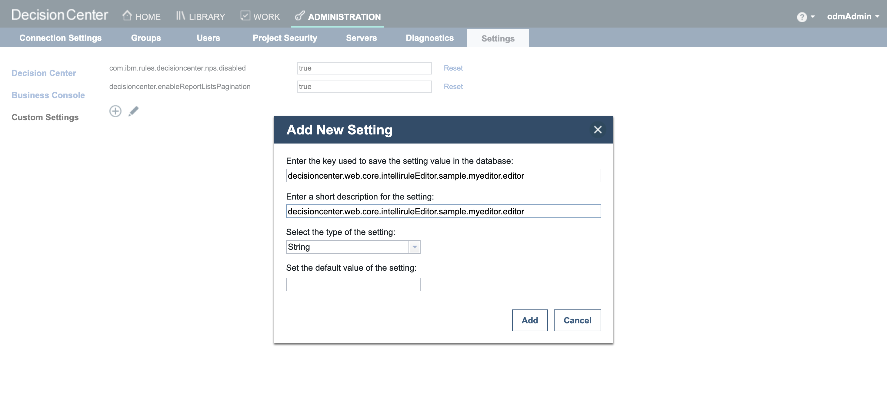

# Introduction

This README explains how to run the Custom Value Editor sample in Kubernetes.
Before following the steps below, make sure you have built the images as explained in [README.md](README.md).

#  Configuring the sample in Kubernetes

## 1. Uploading ZIP file on a file server

Any file server reachable by Decision Center is suitable. 

You can either use an existing one or follow the instructions [here](https://github.com/DecisionsDev/odm-docker-kubernetes/blob/vnext-release/contrib/file-server/README.md#setup-an-httpd-file-server) to deploy a httpd file server in a new pod.

Upload the **businessvalueeditor-1.0.zip** file on the file server :
```
curl -T businessvalueeditor/businessvalueeditor-source/target/businessvalueeditor-1.0.zip $FILESERVER_URL
```

## 2. Deploying ODM

To get access to the ODM material, you must have an IBM entitlement key to pull the images from the IBM Cloud Container registry.

This is what will be used in the next step of this tutorial.

#### a. Retrieve your entitled registry key

- Log in to [MyIBM Container Software Library](https://myibm.ibm.com/products-services/containerlibrary) with the IBMid and password that are associated with the entitled software.

- In the **Container Software and Entitlement Keys** tile, verify your entitlement on the **View library page**, and then go to *Entitlement keys* to retrieve the key.

#### b. Create a pull secret by running the kubectl create secret command

```bash
oc create secret docker-registry my-odm-docker-registry --docker-server=cp.icr.io \
    --docker-username=cp --docker-password="<ENTITLEMENT_KEY>" --docker-email=<USER_EMAIL>
```

Where:

- `<ENTITLEMENT_KEY>`: The entitlement key from the previous step. Make sure to enclose the key in double quotes.
- `<USER_EMAIL>`: The email address associated with your IBMid.

> **Note**
> The `cp.icr.io` value for the docker-server parameter is the only registry domain name that contains the images. You must set the docker-username to `cp` to use the entitlement key as the docker-password.

The my-odm-docker-registry secret name is already used for the `image.pullSecrets` parameter when you run a Helm install of your containers. The `image.repository` parameter is also set by default to `cp.icr.io/cp/cp4a/odm`.

#### c. Add the public IBM Helm charts repository

```bash
helm repo add ibm-helm https://raw.githubusercontent.com/IBM/charts/master/repo/ibm-helm
helm repo update
```

#### d. Check your access to the ODM chart

```bash
$ helm search repo ibm-odm-prod
NAME                    CHART VERSION APP VERSION DESCRIPTION
ibm-helm/ibm-odm-prod   24.0.0        9.0.0.0     IBM Operational Decision Manager
```
#### e. Install an IBM Operational Decision Manager release

Create a file named **values.yaml**. This file will be used by the **helm install** command to specify the configuration parameters. 

Add the lines below in **values.yaml** to let Decision Center download the customization zip file (replace **<FILESERVER_URL>** by the actual URL of the file server hosting the zip):
```
decisionCenter:
  downloadUrl:
    - <FILESERVER_URL>/businessvalueeditor-1.0.zip
```

Add all the other parameters suitable to your platform in `values.yaml`. Check this [link](https://github.com/DecisionsDev/odm-docker-kubernetes/tree/master/platform) for help.

If you are on OCP, you can use this [values.yaml](./businessvalueeditor-source/values.yaml) file by replacing `<FILESERVER_URL>` by the actual URL of the file server hosting the JARs.

```bash
helm install businessvalueeditor-sample ibmcharts/ibm-odm-prod -f values.yaml
```

#  Using the Sample

**Log in** to the Business Console at **http://<HOST:PORT>/decisioncenter** using the credentials:  
   - **Username**: `odmAdmin`  
   - **Password**: `odmAdmin`

To activate the Custom Value Editor, after login in Decision Center as an administrator :
- Go in the menu **Administration>Settings>Custom Settings**
- Register a new setting named **decisioncenter.web.core.intelliruleEditor.sample.myeditor.editor** keeping blank the **default value of the setting** field.



- Set the value of **decisioncenter.web.core.intelliruleEditor.sample.myeditor.editor** to **businessvalueeditor.OfferValueEditorProvider**


Load the [ValueEditorService.zip](./projects/ValueEditorService.zip) Decision Service.

Follow [Running this sample](https://www.ibm.com/docs/en/odm/9.0.0?topic=editor-custom-value-sample-details#businessconsolecustomvalueeditorsampledetails__rssamples.uss_rs_smp_tsauthoring.1025134__title__1) details to understand how to use the custom value editor.

Below is the Custom Value Editor display inside the Business Console :


