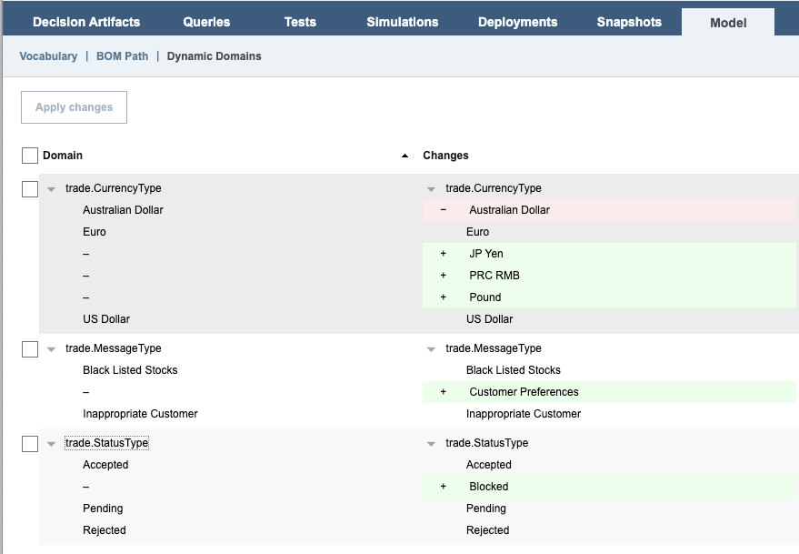

# Introduction

This readme explains how to run the BOM dynamic domain sample in Docker.

Doing so, you do not need to have ODM installed. Instead we are relying on the [ODM for developers](https://github.com/DecisionsDev/odm-for-developers) container image.

Before following the steps below, make sure you have built the customization JAR as explained in [README.md](README.md).

#  Configuring the sample for Docker

## 1. Start the ODM container

1. In the BOM dynamic domain sample root directory (`odm-container-samples/decisioncenter/dynamicdomain`), run
    ```bash
    docker run -d --name odmdev \
        -v $(pwd)/src/ilog.rules.studio.samples.bomdomainpopulate/target/bomdomainpopulate-1.0.jar:/config/apps/decisioncenter.war/WEB-INF/lib/bomdomainpopulate-1.0.jar \
        -v $(pwd)/sql_scripts:/script/sql \
        -p 9060:9060 -p 9443:9443 \
        -m 2048M --memory-reservation 2048M \
        -e LICENSE=accept \
        -e SAMPLE=true \
        icr.io/cpopen/odm-k8s/odm:9.0
    ```

1. then, run
    ```
    docker exec odmdev sh -c "cp /config/resources/h2*.jar /config/apps/decisioncenter.war/WEB-INF/lib/h2.jar"
    docker restart odmdev
    ```

## 2. Initializing the dynamic domains database

- Run
    ```bash
    docker exec odmdev sh -c "java \
        -cp /config/resources/h2*.jar \
        org.h2.tools.RunScript \
        -url jdbc:h2:/config/dbdata/bomdomain \
        -user sa \
        -script /script/sql/createAndPopulate.sql \
        -showResults"
    ```

# Using the sample

1. Log in into the Business Console.
    - user = `rtsAdmin`
    - password = `rtsAdmin`
1. Navigate to the **Administration** tab. In the **Settings** sub-tab, click **Custom Setting** and click the *Add custom setting* **icon** and set:
    - name = `teamserver.derbyDataBaseDomainProvider`
    - description = `derbyDataBaseDomainProvider`
    - type = `String`
    - leave `default value` empty
1. Set the value of the new custom setting to `ilog.rules.studio.samples.bomdomainpopulate.DataBaseDomainValueProvider`
1. Navigate to the **Library** tab.
1. Import the rule project archive `projects/bomdomainpopulate-rules.zip`.
    > Note: this rule project `bomdomainpopulate-rules` is only aimed at editing rules to demonstrate loading domains from a database. It is missing a deployment configuration and cannot be executed.
1. Display the rule `CheckOrder > OrderType`. Notice the error **Value (string) 'CompanyX' is incorrect**. Edit the rule and either remove **"CompanyX"** and press SPACE or double-click **"CompanyX"**. A list of suitable companies gets displayed in a drop-down. Close down the rule without saving.
1. Display the rule `CheckCurrency > CurrencyRestriction`. No warning is displayed.
1. Let's now make some changes in the dynamic domains in the database. Run:
    ```bash
    docker exec odmdev sh -c "java \
        -cp /config/resources/h2*.jar \
        org.h2.tools.RunScript \
        -url jdbc:h2:/config/dbdata/bomdomain \
        -user sa \
        -script /script/sql/modifyTables.sql \
        -showResults"
    ```
1. Display the rule `CheckOrder > OrderType` back again. Notice that there is no error anymore. The effects of the changes done in the database are taken into account automatically because the values that the field `stock` can take are dynamically fetched from the database (and not stored in the BOM).
1. Conversely if you display the rule `CheckCurrency > CurrencyRestriction`, there is still no warning. So let's now import the changes done in the database into the BOM. Click the **Model** tab, and then the **Dynamic Domains** sub-tab. Expand all the three domains. You should see this: (Notice that the **Australian Dollar** was removed)

    

1. Tick **Domain** to select all the domains, and click the **Apply changes** button. Confirm the change.
1. Display the rule `CheckCurrency > CurrencyRestriction` back again. Now a warning `'Australian Dollar' is deprecated` is displayed as the result of the update of the Dynamic Domains in the BOM.
