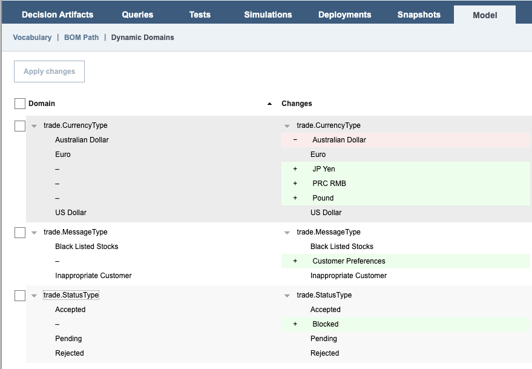

# Introduction

This README explains how to run the BOM dynamic domain sample in Kubernetes.

#  Configuring the sample in Kubernetes

## 1. Uploading JARs on a file server

The customization JARs can be made available to Decision Center in two ways:
1. the **legacy way**: by copying the JARs to a PVC and referencing this PVC using the parameter `decisionCenter.customlibPvc`
1. or the **new way** (since 9.0 only): by copying the JARs on a file server and referencing the files to download from this file server using the parameter `decisionCenter.downloadUrl`

This document explains how to follow the **new way**. Any file server reachable by Decision Center is suitable. You can either use an existing one or follow the instructions [here](../README.md#setup-an-httpd-file-server) to deploy a httpd file server in a new pod.

However you must use the **legacy way** if you deploy a version of ODM older than 9.0. Here are some [instructions](https://www.ibm.com/docs/en/odm/9.0.0?topic=kubernetes-customizing-decision-center-business-console) in the documentation.

Two JARs must be made available:
  1. the Decision Center extension JAR built [previously](README.md#building-the-decision-center-extension-jar),
  1. the JDBC driver of the database storing the data of the dynamic domains.

Download the JDBC driver (if the internal PostgreSQL database is used):
```
curl -kLo jdbc-driver.jar https://jdbc.postgresql.org/download/postgresql-42.5.6.jar
```

Upload the two JARs on the file server (the files must be named `bomdomainpopulate-1.0.jar` and `jdbc-driver.jar` because Decision Center will be configured to download files named that way):
```
curl -T target/bomdomainpopulate-1.0.jar $FILESERVER_URL
curl -T jdbc-driver.jar $FILESERVER_URL
```

## 2. Deploying ODM

Add the public IBM Helm charts repository:
```bash
helm repo add ibmcharts https://raw.githubusercontent.com/IBM/charts/master/repo/ibm-helm
helm repo update
````

Check that you can access the ODM charts:
```bash
helm search repo ibm-odm-prod
```
```bash
NAME                        	CHART VERSION	APP VERSION	DESCRIPTION
ibmcharts/ibm-odm-prod      	<version>     <version>  	IBM Operational Decision Manager  License By in...
```

Create a file named `values.yaml`. This file will be used by the `helm install` command to specify the configuration parameters. 

Add the lines below in `values.yaml` to let Decision Center download the customization JARs (replace `<FILESERVER_URL>` by the actual URL of the file server hosting the JARs):
```yaml
decisionCenter:
  downloadUrl:
    - <FILESERVER_URL>/bomdomainpopulate-1.0.jar
    - <FILESERVER_URL>/jdbc-driver.jar
```

Add the lines below in `values.yaml` if you want to deploy ODM only for the purpose of testing the sample (in that case it is straightforward to use the PostgreSQL internal database and persist the data in ephemeral storage): 
```yaml
internalDatabase:
  persistence:
    enabled: false
    useDynamicProvisioning: false
  populateSampleData: true
  runAsUser: ''
```

Add all the other parameters suitable to your platform in `values.yaml`. Check this [link](https://github.com/DecisionsDev/odm-docker-kubernetes/tree/master/platform) for help.

Install an ODM release named `myodmsample` (if you choose a different release name, you need to edit the file [database.properties](src/ilog.rules.studio.samples.bomdomainpopulate/src/main/resources/data/database.properties)):
```bash
helm install myodmsample ibmcharts/ibm-odm-prod -f values.yaml
```

## 3. Configuring Decision Center

The class that implements the customization must be declared:
- either using a custom setting
- or using a JVM parameter 

### 3.1 Using a custom setting
1. Log in into the Business Console as an admin
1. Navigate to Administration > Settings > Custom Settings
1. Click the "Add custom setting" icon and set:
    - name = `teamserver.derbyDataBaseDomainProvider`
    - description = `derbyDataBaseDomainProvider`
    - type = `String`
    - leave `default value` empty
1. Set the value to `ilog.rules.studio.samples.bomdomainpopulate.DataBaseDomainValueProvider`

### 3.2 Using a JVM parameter

Follow instructions similar to [here](https://www.ibm.com/docs/en/odm/9.0.0?topic=kubernetes-persisting-decision-center-ruleset-cache) to add the JVM parameter below: (using in a Config Map referenced by the Helm parameter **decisionCenter.jvmOptionsRef**)
```
-Dilog.rules.teamserver.derbyDataBaseDomainProvider=ilog.rules.studio.samples.bomdomainpopulate.DataBaseDomainValueProvider
```

## 4. Initializing the database

1. If the data of the dynamic domains are stored in the internal PostgreSQL database, you can find the name of that pod by running:
    ```bash
    DBSERVER=$(kubectl get pods --no-headers -o custom-columns=":metadata.name" |grep dbserver)
    echo $DBSERVER
    ```

1. Navigate to the BOM dynamic domain sample directory:
    ```bash
    cd decisioncenter/dynamicdomain
    ```

1. Copy the initialization SQL script into the pod and execute it:
    ```bash
    kubectl cp ./sql_scripts/createAndPopulate.sql $DBSERVER:/tmp
    kubectl exec $DBSERVER -- psql -U odmusr -d odmdb -f /tmp/createAndPopulate.sql
    ```

## 5. Using the Sample

1. Log in into the Business Console.
1. Navigate to the **Library** tab.
1. Import the rule project archive `projects/bomdomainpopulate-rules.zip`.
    > Note: this rule project `bomdomainpopulate-rules` is only aimed at editing rules to demonstrate loading domains from a database. It is missing a deployment configuration and cannot be executed.
1. Display the rule `CheckOrder > OrderType`. Notice the error **Value (string) 'CompanyX' is incorrect**. Edit the rule and either remove **"CompanyX"** and press SPACE or double-click **"CompanyX"**. A list of suitable companies gets displayed in a drop-down. Close down the rule without saving.
1. Display the rule `CheckCurrency > CurrencyRestriction`. No warning is displayed.
1. Let's now make some changes in the dynamic domains in the database. Run:
    ```bash
    kubectl cp ./sql_scripts/modifyTables.sql $DBSERVER:/tmp
    kubectl exec $DBSERVER -- psql -U odmusr -d odmdb -f /tmp/modifyTables.sql
    ```

1. Display the rule `CheckOrder > OrderType` back again. Notice that there is no error anymore. The effects of the changes done in the database are taken into account automatically because the values that the field `stock` can take are dynamically fetched from the database (and not stored in the BOM).
1. Conversely if you display the rule `CheckCurrency > CurrencyRestriction`, there is still no warning. So let's now import the changes done in the database into the BOM. Click the **Model** tab, and then the **Dynamic Domains** sub-tab. Expand all the three domains. You should see this: (Notice that the **Australian Dollar** was removed)

    

1. Tick **Domain** to select all the domains, and click the **Apply changes** button. Confirm the change.
1. Display the rule `CheckCurrency > CurrencyRestriction` back again. Now a warning `'Australian Dollar' is deprecated` is displayed as the result of the update of the Dynamic Domains in the BOM.
