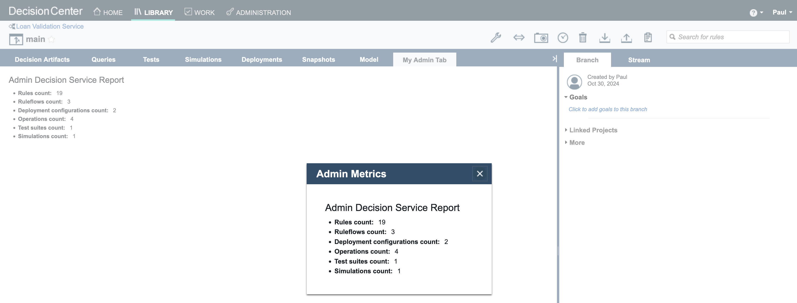

### Introduction

This readme explains how to run the GUI Customization sample in Docker.

Doing so, you do not need to have ODM installed. Instead we are relying on the 'ODM for Developer' container image.

Before following the steps below, make sure you have built the images as explained in [README.md](README.md).

### Running the sample 

   Navigate to the source directory of the GUI Customization sample:
   ```
   cd decisioncenter/guicustomization/guicustomization-source
   ```
      
   Run ODM docker images containing GUI customization:
   ```bash
   docker-compose -f compose-odm-dev.yml up odm-with-gui-customization &
   ```

###  Using the sample

**Log in** to the Business Console at [http://localhost:9060/decisioncenter](http://localhost:9060/decisioncenter) using the credentials:  
   - **Username**: `Paul`  
   - **Password**: `Paul`

Open the **Library** tab. Import the [LoanValidationService.zip](./projects/LoanValidationService.zip) Decision Service.

To activate the GUI customization:
- Go in the menu **Administration>Settings>Custom Settings**
- Register a new setting named **decisioncenter.web.core.extensions.entrypoints** keeping blank the **default value of the setting** field.


- Set the value of **decisioncenter.web.core.extensions.entrypoints** to **extensions/AddTabEntryPoint,extensions/AddButtonEntryPoint,extensions/AddEditorButtonEntryPoint**


#### To see the customization for an administrator:

Log in to the Business console by using **Paul** as the username and password.

Open the **Library** tab. Click the **Loan Validation Service** box anywhere but the name, and select the **main** branch.

Click the new button **My Admin Button** in the main toolbar. A dialog displays metrics on the decision service. Close the dialog.

Click the new tab **My Admin Tab**. The tab displays the same metrics on the decision service.

Click the **Decision Artifacts** tab. Expand the **computation** package of the **Loan Validation Scoring** project. Edit the rule **neverBankruptcy** (accept any default settings if prompted).

Click the button **My Info**. A dialog displays information on the rule.

Close the dialog and cancel the editing session to go back to the **Decision Artifacts** tab. 

Make sure that the **Operations** type are displayed. To display them, click **Types** and select **Operations**.

Click the **Operations** element under **Loan Validation Scoring** project and edit the **scoring** operation.

Click the button **My Operation Info**. A dialog displays information on the operation.

Close the dialog, and cancel the editing session to go back to the **Decision Artifacts** tab. 

Click the **Deployments** tab and edit the **test deployment** configuration.

Click the **Targets** tab and make sure the **Decision Service Execution** server is well selected. Save the **test deployment** configuration and create a new version.

Click the name of the **test deployment** configuration.

Click the **Custom Deploy** button in the toolbar. This will start the deployment and a dialog shows its status: _Deploying..._ to _Report status: COMPLETED_

Close the dialog and log out of the Business Console.



#### To see the customization for a non-administrative user:

Log in to the Business Console by using **Bea** as the username and password.

Open the **Library** tab. Click the **Loan Validation Service** box anywhere but the name, and then select the **main** branch.

Click the new button **My Button**. A dialog displays some metrics on the decision service. The dialog content is different from the content that is provided for the an administrator user.

Close the dialog and then click the new tab **My Tab**. The tab displays the same metrics on the decision service. The tab content is different from the content that is provided for an administrator user.

Log out of the Business Console.


### Stopping the sample

```bash
docker-compose -f compose-odm-dev.yml down
```


