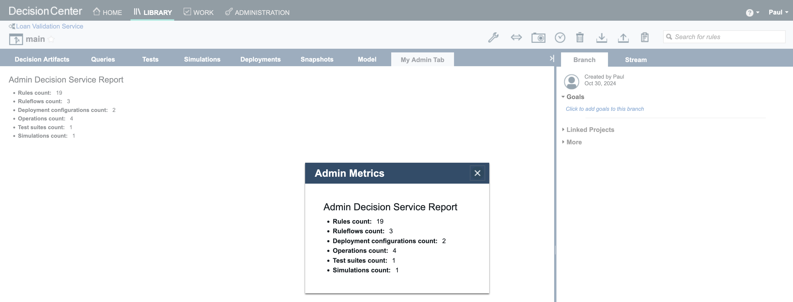

# Introduction

This readme explains how to run the GUI Customization sample in Kubernetes.
Before following the steps below, make sure you have built the images as explained in [README.md](README.md).

#  Configuring the sample in Kubernetes

## 1. Uploading JARs on a file server

Any file server reachable by Decision Center is suitable.

You can either use an existing one or follow the instructions [here](https://github.com/DecisionsDev/odm-docker-kubernetes/blob/vnext-release/contrib/file-server/README.md#setup-an-httpd-file-server) to deploy an httpd file server in a new pod.

Upload the **guicustomization-1.0.jar** file on the file server:
```
curl -T guicustomization/guicustomization-source/target/guicustomization-1.0.jar $FILESERVER_URL
```

## 2. Deploying ODM

To get access to the ODM material, you must have an IBM entitlement key to pull the images from the IBM Cloud Container registry.

This is what will be used in the next step of this tutorial.

#### a. Retrieve your entitled registry key

- Log in to [MyIBM Container Software Library](https://myibm.ibm.com/products-services/containerlibrary) with the IBMid and password that are associated with the entitled software.

- In the **Container Software and Entitlement Keys** tile, verify your entitlement on the **View library page**, and then go to *Entitlement keys* to retrieve the key.

#### b. Create a pull secret by running the kubectl create secret command

```bash
oc create secret docker-registry my-odm-docker-registry --docker-server=cp.icr.io \
    --docker-username=cp --docker-password="<ENTITLEMENT_KEY>" --docker-email=<USER_EMAIL>
```

Where:

- `<ENTITLEMENT_KEY>`: The entitlement key from the previous step. Make sure to enclose the key in double quotes.
- `<USER_EMAIL>`: The email address associated with your IBMid.

> **Note**
> The `cp.icr.io` value for the docker-server parameter is the only registry domain name that contains the images. You must set the docker-username to `cp` to use the entitlement key as the docker-password.

The my-odm-docker-registry secret name is already used for the `image.pullSecrets` parameter when you run a Helm install of your containers. The `image.repository` parameter is also set by default to `cp.icr.io/cp/cp4a/odm`.

#### c. Add the public IBM Helm charts repository

```bash
helm repo add ibm-helm https://raw.githubusercontent.com/IBM/charts/master/repo/ibm-helm
helm repo update
```

#### d. Check your access to the ODM chart

```bash
helm search repo ibm-odm-prod
```
```bash
NAME                    CHART VERSION APP VERSION DESCRIPTION
ibm-helm/ibm-odm-prod   25.0.0        9.5.0.0     IBM Operational Decision Manager
```

#### e. Create a secret to manage custom authentication/authorization

Create a secret to manage custom authentication/authorization using the [webSecurity.xml](./guicustomization-source/webSecurity.xml) and [group-security-configurations.xml](./guicustomization-source/group-security-configurations.xml) files:

```
kubectl create secret generic my-custom-auth-secret --from-file=webSecurity.xml --from-file=group-security-configurations.xml
```
#### f. Install an IBM Operational Decision Manager release

Create a file named `values.yaml`. This file will be used by the `helm install` command to specify the configuration parameters.

Add the lines below in `values.yaml` to let Decision Center download the customization JARs (replace `<FILESERVER_URL>` by the actual URL of the file server hosting the JARs):
```
customization:
  authSecretRef: my-custom-auth-secret
decisionCenter:
  downloadUrl:
    - <FILESERVER_URL>/guicustomization-1.0.jar
```

Add all the other parameters suitable to your platform in `values.yaml`. Check this [link](https://github.com/DecisionsDev/odm-docker-kubernetes/tree/master/platform) for help.

If you are on OCP, you can use this [values.yaml](./guicustomization-source/values.yaml) file by replacing `<FILESERVER_URL>` by the actual URL of the file server hosting the JARs.

```bash
helm install guicustomization-sample ibm-helm/ibm-odm-prod -f values.yaml
```

#  Using the Sample

**Log in** to the Business Console at **https://<HOST:PORT>/decisioncenter** using the credentials:  
   - **Username**: `Paul`  
   - **Password**: `Paul`

Open the **Library** tab. Import the [LoanValidationService.zip](./projects/LoanValidationService.zip) Decision Service.

To activate the Custom Value Editor, after login in Decision Center:
- Go in the menu **Administration>Settings>Custom Settings**
- Register a new setting named **decisioncenter.web.core.extensions.entrypoints** keeping blank the **default value of the setting** field.


- Set the value of **decisioncenter.web.core.extensions.entrypoints** to **extensions/AddTabEntryPoint,extensions/AddButtonEntryPoint,extensions/AddEditorButtonEntryPoint**


Open the **Library** tab. Click the **Loan Validation Service** box anywhere but the name, and select the **main** branch.

Click the new button **My Admin Button** in the main toolbar. A dialog displays metrics on the decision service. Close the dialog.

Click the new tab **My Admin Tab**. The tab displays the same metrics on the decision service.



Click the **Decision Artifacts** tab. Expand the **computation** package of the **Loan Validation Scoring** project. Edit the rule **neverBankruptcy** (accept any default settings if prompted).

Click the button **My Info**. A dialog displays information on the rule.

Close the dialog and cancel the editing session to go back to the **Decision Artifacts** tab. 

Make sure that the **Operations** type are displayed. To display them, click **Types** and select **Operations**.

Click the **Operations** element under **Loan Validation Scoring** project and edit the **scoring** operation.

Click the button **My Operation Info**. A dialog displays information on the operation.

Close the dialog, and cancel the editing session to go back to the **Decision Artifacts** tab. 

Click the **Deployments** tab and edit the **test deployment** configuration.

Click the **Targets** tab and make sure the **Decision Service Execution** server is well selected. Save the **test deployment** configuration and create a new version.

Click the name of the **test deployment** configuration.

Click the **Custom Deploy** button in the toolbar. This will start the deployment and a dialog shows its status: _Deploying..._ to _Report status: COMPLETED_

Close the dialog and log out of the Business Console.

#### To see the customization for a non-administrative user:

Log in to the Business Console by using **Bea** as the username and password.

Open the **Library** tab. Click the **Loan Validation Service** box anywhere but the name, and then select the **main** branch.

Click the new button **My Button**. A dialog displays some metrics on the decision service. The dialog content is different from the content that is provided for the an administrator user.

Close the dialog and then click the new tab **My Tab**. The tab displays the same metrics on the decision service. The tab content is different from the content that is provided for an administrator user.


Log out of the Business Console.

### Stopping the sample

```bash
helm uninstall guicustomization-sample
```
