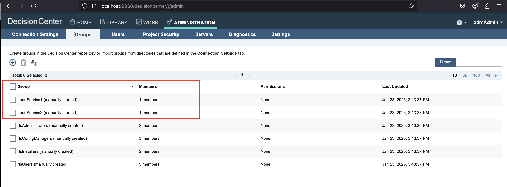
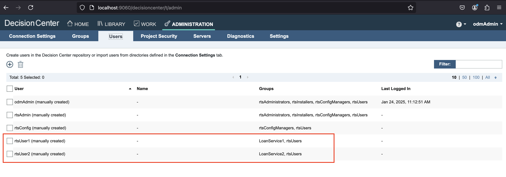
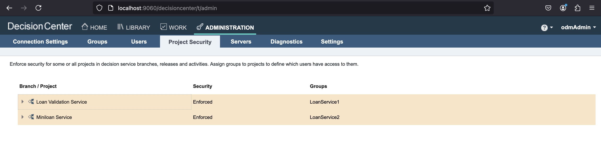
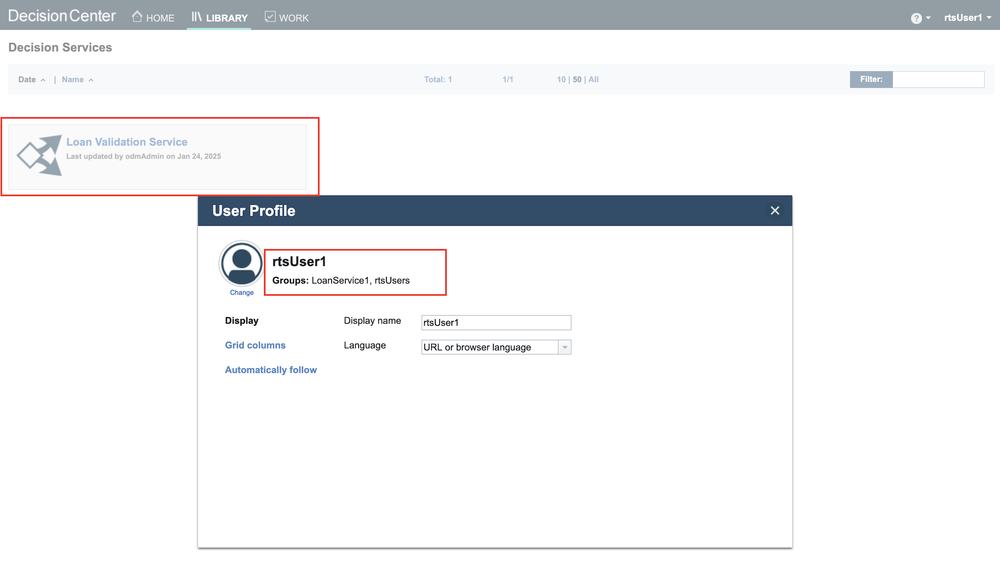
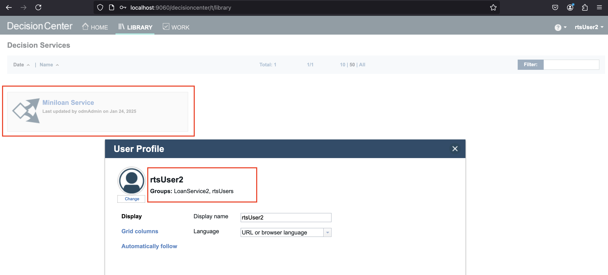
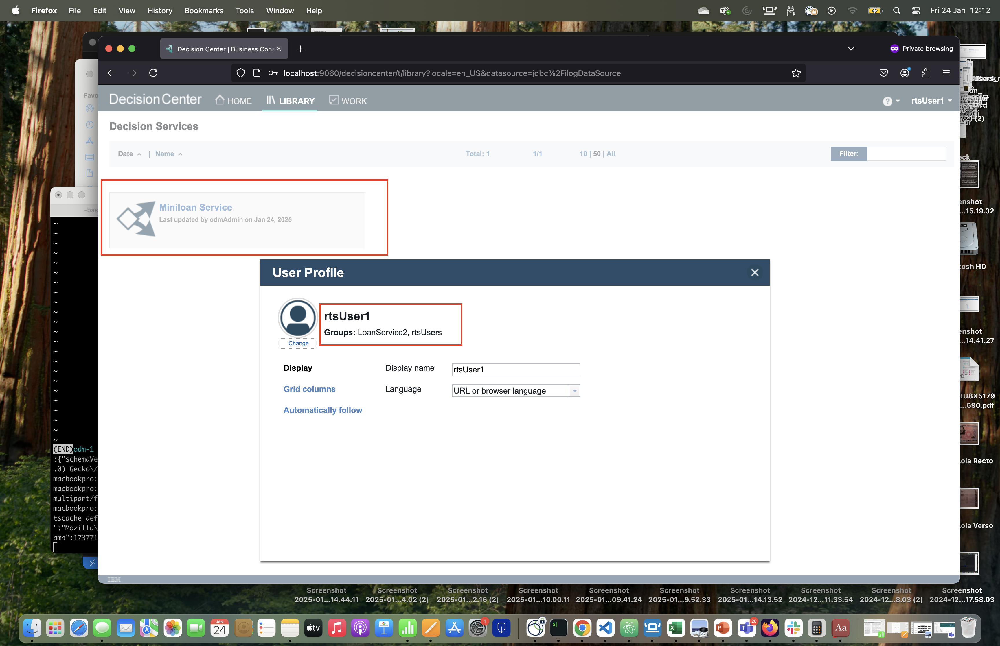
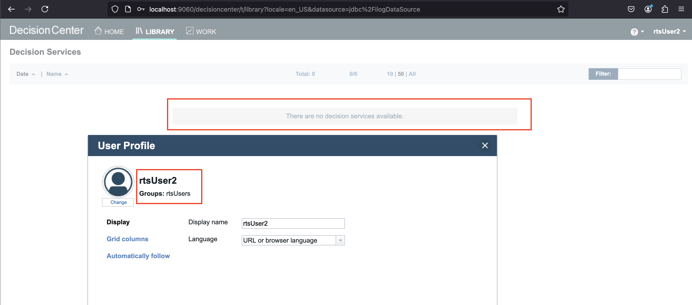

## Introduction

This README explains how to set up and run the Customizable Users/Groups Synchronization sample in a Kubernetes environment.

## Prerequisites

To access the IBM Operational Decision Manager (ODM) material, you must have an IBM entitlement key to pull images from the IBM Cloud Container Registry.

This is what will be used in the next step of this tutorial.

---
## Setup in Kubernetes

### 1. Retrieve Your Entitlement Key

- Log in to [MyIBM Container Software Library](https://myibm.ibm.com/products-services/containerlibrary) with the IBMid and password that are associated with the entitled software.

- In the **Container Software and Entitlement Keys** tile, verify your entitlement on the **View library page**, and then go to *Entitlement keys* to retrieve the key.

### 2. Create a Pull Secret

Run the following command to create a Kubernetes secret for pulling images:

```bash
oc create secret docker-registry my-odm-docker-registry --docker-server=cp.icr.io \
    --docker-username=cp --docker-password="<ENTITLEMENT_KEY>" --docker-email=<USER_EMAIL>
```

Where:

- `<ENTITLEMENT_KEY>`: The entitlement key from the previous step. Make sure to enclose the key in double quotes.
- `<USER_EMAIL>`: The email address associated with your IBMid.

> **Note**
> The `cp.icr.io` value for the docker-server parameter is the only registry domain name that contains the images. You must set the docker-username to `cp` to use the entitlement key as the docker-password.

The my-odm-docker-registry secret name is already used for the `image.pullSecrets` parameter when you run a Helm install of your containers. The `image.repository` parameter is also set by default to `cp.icr.io/cp/cp4a/odm`.

### 3. Add the IBM Helm Charts Repository

```bash
helm repo add ibm-helm https://raw.githubusercontent.com/IBM/charts/master/repo/ibm-helm
helm repo update
```

### 4. Verify Access to the ODM Chart

```bash
$ helm search repo ibm-odm-prod
NAME                    CHART VERSION APP VERSION DESCRIPTION
ibm-helm/ibm-odm-prod   25.1.0        9.5.0.1     IBM Operational Decision Manager
```
### 5. Create the Synchronization Secret

We create a secret that will be used inside the Decision Center sidecar container to synchronize users and groups.

```shell
kubectl create secret generic users-groups-synchro-secret \
        --from-file=sidecar-start.sh \
        --from-file=group-security-configurations.xml
```

### 6. Install IBM ODM with Synchronization Enabled

Create a `values.yaml` file with the following content:

Create a file named `values.yaml`
This file will be used by the **helm install** command to specify the configuration parameters. 

Add the lines below in **values.yaml** to create the Decision Center sidecar and populate the sample projects:


Add all the other parameters suitable to your platform in `values.yaml`. Check this [link](https://github.com/DecisionsDev/odm-docker-kubernetes/tree/master/platform) for help.

If you are on OCP, you can use this [values.yaml](./users_groups_synchronization-source/values.yaml).

```bash
helm install synchro-sample ibmcharts/ibm-odm-prod -f values.yaml
```
---
##  Using the Sample
### 1. Log in to the Business Console
**Log in** to the Business Console at **http://<HOST:PORT>/decisioncenter** using the credentials:
   - **Username**: `odmAdmin`  
   - **Password**: `odmAdmin`

---
### 2. Verify Users and Groups Synchronization

#### Groups
To check the custom Users and Groups are corrected imported, after login in Decision Center as an administrator:
- Navigate to **Administration > Groups**.
- Ensure that `LoanService1` and `LoanService2` groups are present.



#### Users

1. Navigate to **Administration > Users**.
2. Verify:
   - `rtsUser1` belongs to `LoanService1`.
   - `rtsUser2` belongs to `LoanService2`.



### 3. Enable Security for Decision Services

In this section, you will configure access control for decision services in Decision Center Business Console. The goal is to restrict access to specific decision services based on user group membership, ensuring that only authorized users can view and modify certain projects.

We will enable the security by restricting the access to the **Loan Validation Service** project only to users that belong to the **LoanService1** group (like rtsUser1) and restricting the access to the **Miniloan Service** project only to users that belong to the **LoanService2** group (like rtsUser2):

| User      | Group        | Accessible Project         |
|-----------|-------------|---------------------------|
| rtsUser1  | LoanService1 | Loan Validation Service  |
| rtsUser2  | LoanService2 | Miniloan Service        |

#### Loan Validation Service

1. Navigate to **Administration > Project Security**.
2. Click **Edit decision service security** for **Loan Validation Service**.
3. Select **Enforce security** and choose `LoanService1`.
4. Click **Done**.

#### Miniloan Service


1. Navigate to **Administration > Project Security**.
1. Click on the **Edit decision service security** button of the **Miniloan Service** project
2. Click on the **Security is not enforced for this decision service** link
3. Choose **Enforce security**
4. Select the **LoanService2** group
5. Click **Done** 





### 4. Validate User Access

#### `rtsUser1`

1. Click on **odmAdmin** at the top right corner
2. Click on **Log out** link
3. **Log in** to the Business Console using the credentials:
   - **Username**: `rtsUser1`
   - **Password**: `odmAdmin`
4. Verify that only **Loan Validation Service** is visible under the **LIBRARY** tab.
5. Click on **rtsUser1** at the top right corner
6. Click on the **Profile** link
7. Check that **Groups** is well displaying **LoanService1, rtsUsers**




#### `rtsUser2`

1. Click on **rtsUser1** at the top right corner
2. Click on **Log out** link
3. **Log in** to the Business Console using the credentials:
   - **Username**: `rtsUser2`
   - **Password**: `odmAdmin`
4. Verify that only **Miniloan Service** is visible under the **LIBRARY** tab.
5. Click on **rtsUser2** at the top right corner
6. Click on the **Profile** link
7. Check that **Groups** is well displaying **LoanService2, rtsUsers**
   


--- 
## Updating User Group Assignments

As part of organizational changes, **rtsUser1** has transitioned from the **LoanService1** service to the **LoanService2** service, while **rtsUser2** is no longer part of the **LoanService2** service.

| User      | Group        | Accessible Project         |
|-----------|-------------|---------------------------|
| rtsUser1  | LoanService2 | Miniloan Service        |


### 1. Modify Group Assignments

In the new-group-security-configurations.xml file you can this organizational changes:

#### Before:

```xml
<user name="rtsUser1" groups="LoanService1, rtsUsers"/>
<user name="rtsUser2" groups="LoanService2, rtsUsers"/>
```

#### After:

```xml
<user name="rtsUser1" groups="LoanService2, rtsUsers"/>
<user name="rtsUser2" groups="rtsUsers"/>
```


### 2. Apply the Updated Configuration

To synchronize this organizational update with the Decision Center Business Console, update the `group-security-configurations.xml` file within the **users-groups-synchro-secret** secret.  

You can edit the file directly using the cloud platform editor or update the Kubernetes secret with the following command:  

```bash
NEW_FILE=$(base64 < "./new-group-security-configurations.xml" | tr -d '\n')
kubectl patch secret users-groups-synchro-secret -p "{\"data\":{\"group-security-configurations.xml\":\"${NEW_FILE}\"}}"
```

### 3. Verify Synchronization

Montor logs to ensure the updated group-security-configurations.xml is consumed by the sidecar script:

```bash
DC_POD=$(kubectl get pods -o name | grep odm-decisioncenter)
kubectl logs $DC_POD -c sidecar -f
```

### 4. Validate New Access Rules

#### `rtsUser1`
Check that new access is correctly set for the **rtsUser1** user:
1. Click on **rtsUser2** at the top right corner
2. Click on **Log out** link
3. **Log in** to the Business Console using the credentials:
   - **Username**: `rtsUser1`
   - **Password**: `odmAdmin`
4. Click on the **LIBRARY** tab
5. Check that only the **Miniloan Service** project is visible
6. Click on **rtsUser1** at the top right corner
7. Click on the **Profile** link
8. Check that **Groups** is well displaying **LoanService2, rtsUsers**



#### `rtsUser2`

Check that access is correctly set for the **rtsUser2** user:
1. Click on **rtsUser1** at the top right corner
2. Click on **Log out** link
3. **Log in** to the Business Console using the credentials:
   - **Username**: `rtsUser2`
   - **Password**: `odmAdmin`
4. Click on the **LIBRARY** tab
5. Check there is no accessible decision service 
6. Click on **rtsUser2** at the top right corner
7. Click on the **Profile** link
8. Check that **Groups** is well displaying **rtsUsers**



--- 

## Integration with the Entra ID rest-api

For a more advanced synchronization scenario, you can integrate with the **Entra ID REST API**. This approach serves as an alternative to LDAP and SCIM data sources for user and group management in Decision Center.

Refer to the [Entra ID tutorial](https://github.com/DecisionsDev/odm-docker-kubernetes/blob/master/authentication/AzureAD/README_WITH_CLIENT_SECRET.md) for detailed implementation steps.

