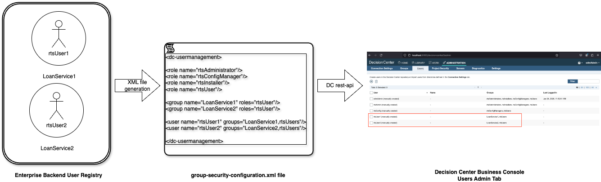
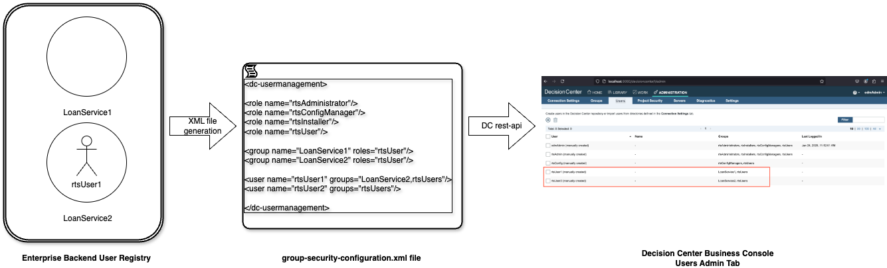

# Customizable Users/Groups Synchronization Sample

## Introduction

This sample demonstrates how to synchronize users and groups in the Decision Center Business Console administration tab with an external enterprise repository. This repository can be an LDAP directory, an OpenID user registry, or any other backend or business logic system.

The imported users and groups in the Business Console enable fine-grained permission management. When project security is enabled, a decision service is only visible to users belonging to specific groups. 

This sample illustrates how to synchronize enterprise organizational changes within Decision Center, such as:
   * A user leaving the company, resulting in their removal from groups and loss of access to projects.
   * A new user joining the company and being assigned to groups to work on specific projects.
   * A user changing organizational groups, requiring updates to their project access.

## Scenario

In this sample, we will use two users, `rtsUser1` and `rtsUser2`, who belong to two enterprise services, `LoanService1` and `LoanService2`, respectively. 

The organizational structure is maintained in a user registry backend such as LDAP, Entra ID, or an Amazon Cognito user pool, ...

This structure is reflected in an XML file named `group-security-configurations.xml`, which Decision Center uses to manage access permissions for Decision Services. We will enforce project security as follows:

- The **Loan Validation Service** project is accessible only to users belonging to the `LoanService1` group (i.e., `rtsUser1`).
- The **Miniloan Service** project is accessible only to users belonging to the `LoanService2` group (i.e., `rtsUser2`).

Organizational changes occur as follows:

- `rtsUser1` moves from `LoanService1` to `LoanService2`.
- `rtsUser2` is removed from `LoanService2`.

These updates are reflected in a new XML configuration file, `new-group-security-configurations.xml`, which is consumed by Decision Center. As a result, project access is updated accordingly:

- `rtsUser1` now has access to the **Miniloan Service** project instead of the **Loan Validation Service** project.
- `rtsUser2` loses access to all projects.

This sample demonstrates how Decision Center dynamically adapts to organizational changes, ensuring accurate and up-to-date access control.

## Running this sample in Decision Center

### 1) Prerequisites

Before you begin, ensure you have at least Docker 24.0.x (and optionally Kubernetes 1.27+).

### 2) Instructions to use the sample in Decision Center

Click one of the links below:
   * In [Kubernetes](README-KUBERNETES.md).
   * In [Docker](README-DOCKER.md). 
