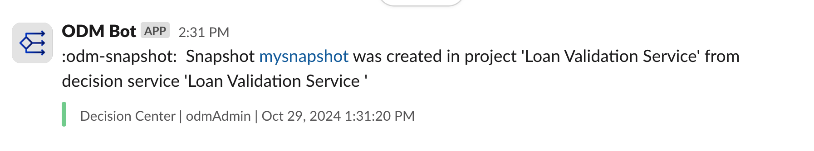

### Introduction

This readme explains how to run the webhook sample in Docker.

Doing so, you do not need to have ODM installed. Instead we are relying on the 'ODM for developer' container image.

Before following the steps below, make sure you have built the images as explained in [README.md](README.md).

### Running the sample 

1.  Run ODM and Notifiers  docker images
    ```bash
    docker-compose  -f docker-compose.yaml -f compose-odm-dev.yml up
    ```

2. Register the webhook in Decision Center using the REST API tool, providing the token and URL (`http://localhost:3000/slack` and `http://localhost:3000/print`).

   1. For the File Notifier:
   ```shell
    curl -X 'PUT' \
    'http://localhost:9060/decisioncenter-api/v1/webhook/notify?url=http%3A%2F%2Flogifle%3A3000%2Fprint' \
    -H 'accept: */*' \
    -H 'Content-Type: application/json' \
    -d 'null' \
    -u odmAdmin:odmAdmin
    ```

   2. For the Slack Notifier:
    
    ```shell
    export SLACK_TOKEN=`curl 'http://localhost:3000/token.generate' -H 'accept: */*' -H 'Content-Type: application/json'`

    curl -X 'PUT' \
    'http://localhost:9060/decisioncenter-api/v1/webhook/notify?url=http%3A%2F%2Fslack%3A3000%2Fslack' \
    -H 'accept: */*' \
    -H 'Content-Type: application/json' \
    -d "$SLACK_TOKEN" \
    -u odmAdmin:odmAdmin
    ```


### Using the sample

Once webhooks are configured, specific events in Decision Center will trigger notifications. 

Below is an example scenario that illustrates the process:

#### Scenario: Creating a Snapshot in the Business Console

1. **Log in** to the Business Console at [http://localhost:9060/decisioncenter](http://localhost:9060/decisioncenter) using the credentials:  
   - **Username**: `odmAdmin`  
   - **Password**: `odmAdmin`

2. **Navigate to the Library** tab. Select the **Loan Validation Service** box (click anywhere except the name) and choose the **main branch**.

3. **Take a Snapshot**:
   - Click the **Take a Snapshot** button in the toolbar.
   - In the dialog that appears:
     - Enter a name for the snapshot: `mysnapshot`
     - Click **Create**

#### Viewing the notification file Output

After creating this snapshot, a notification will be triggered. 

To view the content of the generated log file, run the following command:

```shell
docker exec -ti <webhooknotifier-logfile-container-id> sh -c 'cat /app/results/default.txt'
```


The snapshot creation triggers a webhook notification with the following sample payload:

```json
{
  "version": "1.0",
  "id": "e749da20-1f2f-47bb-8a97-568eab4c7f3b",
  "author": "odmAdmin",
  "date": 1730196680692,
  "type": "SnapshotCreated",
  "content": [
    {
      "id": "6f41d82c-d20f-4a2a-8c1d-d6eb5a49f5dd",
      "internalId": "brm.Snapshot:71:71",
      "name": "mysnapshot",
      "createdBy": "odmAdmin",
      "createdOn": 1730196679000,
      "lastchangedBy": "odmAdmin",
      "lastChangedOn": 1730196679000,
      "parentId": "1558f25b-daa6-4982-8b0b-48a388c7c202",
      "documentation": "",
      "buildMode": "DecisionEngine",
      "initial": false,
      "kind": "StandardSnapshot"
    }
  ],
  "details": [
    {
      "targetURL": "http://172.19.0.4:9060/decisioncenter/t/library#overviewsnapshot?id=brm.Snapshot%3A71%3A71&datasource=jdbc%2FilogDataSource&baselineId=brm.Snapshot%3A71%3A71"
    }
  ],
  "sourceName": "Decision Center",
  "sourceLink": "http://172.19.0.4:9060/decisioncenter?datasource=jdbc%2FilogDataSource"
}
```

#### Viewing the Slack notification output

If you have configured the Slack notification, a message with the following content should be displayed in the Docker Compose window:
```log
slack-1    | {
slack-1    |   "version": "1.0",
slack-1    |   "id": "a1039496-4add-40d5-b36f-558f6db5438f",
slack-1    |   "author": "odmAdmin",
slack-1    |   "date": 1730208680316,
slack-1    |   "type": "SnapshotCreated",
slack-1    |   "content": [
slack-1    |     {
slack-1    |       "id": "c6d806d7-f569-44a4-add1-f2ab46f2bd9a",
slack-1    |       "internalId": "brm.Snapshot:71:71",
slack-1    |       "name": "mysnapshot",
slack-1    |       "createdBy": "odmAdmin",
slack-1    |       "createdOn": 1730208680000,
slack-1    |       "lastchangedBy": "odmAdmin",
slack-1    |       "lastChangedOn": 1730208680000,
slack-1    |       "parentId": "1558f25b-daa6-4982-8b0b-48a388c7c202",
slack-1    |       "documentation": "",
slack-1    |       "buildMode": "DecisionEngine",
slack-1    |       "initial": false,
slack-1    |       "kind": "StandardSnapshot"
slack-1    |     }
slack-1    |   ],
slack-1    |   "details": [
slack-1    |     {
slack-1    |       "targetURL": "http://172.18.0.4:9060/decisioncenter/t/library#overviewsnapshot?id=brm.Snapshot%3A71%3A71&datasource=jdbc%2FilogDataSource&baselineId=brm.Snapshot%3A71%3A71"
slack-1    |     }
slack-1    |   ],
```

and a message should appear your slack channel : 



### Stopping the Sample

```bash
docker-compose  -f docker-compose.yaml -f compose-odm-dev.yml down
```


